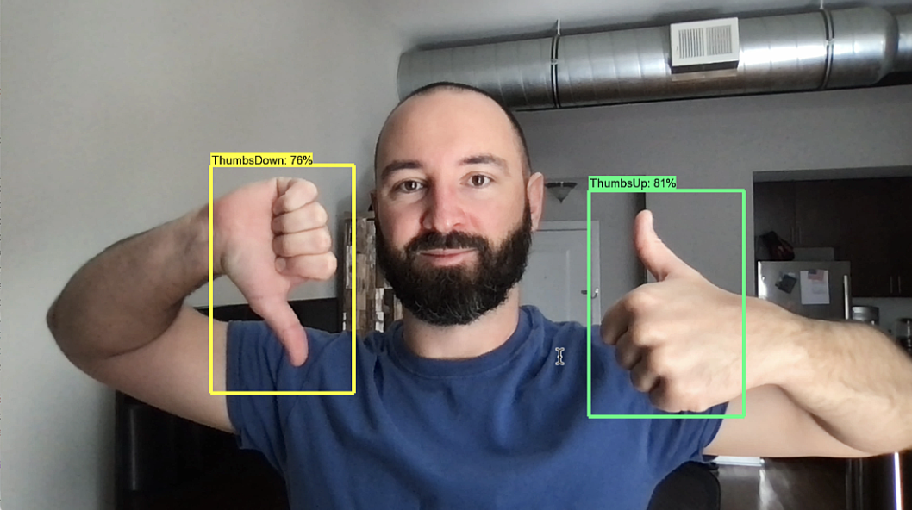
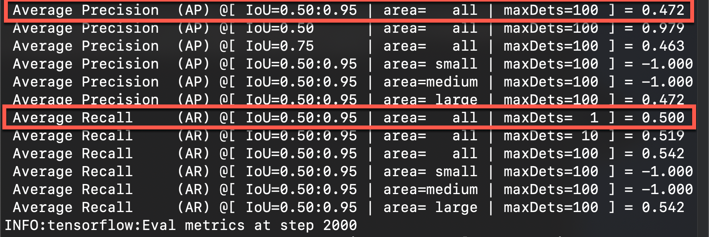
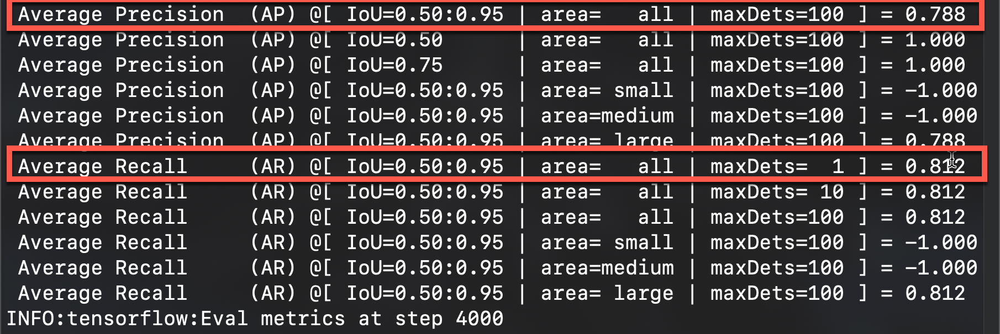

# Tensorflow Object Detection Transfer Learning Project

 

#### This repository has step by step jupyter notebooks that will walk through the process of transfer training a Tensorflow object detection model and performance tune the custom model at the end.

 

## Steps
#### 1) Image Collection
#### 2) Train and Evaluate Model
#### 3) Test Object Detection Model On Image or Live Webcam
#### 4) Export Model
#### 5) Performance - Add Images To Trained Model
#### 6) Performance - Continue To Train Model For More Steps

 

#### This project was based off Nicholas Ronotte's YouTube video here:    (Great YouTube channel for machine learning)
https://www.youtube.com/watch?v=yqkISICHH-U
#### Repository here:
https://github.com/nicknochnack/TFODCourse

 

#### I structured each notebook out so I could follow the notebooks to train and performance tune a model. I added comments to all important steps to fully explain what the code is doing. If you clone the repository, you should be able to go through the entire process with just the notebooks. I plan to use this repository as a base to build different implementations of object detection models.

 

# Setup
#### Create PIP Virtual Environment
<pre>
python3 -m venv NAME-OF-ENVIRONMENT
</pre>

#### Install All Dependencies From requirements.txt Into Your Virtual Environment
<pre>
pip install -r requirements.txt
</pre>

#### The Only Thing Missing From requirments.txt Is Tensorflow Object Detection and Google Protocol Buffers
#### You Install These In Notebook "2-Train-And-Evaluate-Model" After Cloning Tensorflow Models Repo

 

#### Run This Command To Add Your Virtual Environment To Jupyter Notebook Kernel Choices
<pre>
python -m ipykernel install --user --name=INSERT-YOUR-VIRTUAL-ENVIRONMENT-NAME
</pre>

#### Run This Command To Open Jupyter Notebook And Follow Steps
<pre>
jupyter notebook
</pre>

#### Choose Kernel On Your Jupyter Notebook So You Are In The Correct Environment (Do this for each notebook)
#### Shows On Top Right Of Notebook The Environment You Are On. To Change: Kernel > Change Kernel > Choose Kernel

 

#### Now follow each notebook in order by number to create an object detection model and performance tune it after. 

 

### As an example after 2,000 training steps my metrics:

 

### After doubling the images to 40 for each object and doubling the training steps to 4,000 my metrics:

 

### This is just the start, but it performs ok on the webcam for a fun project.